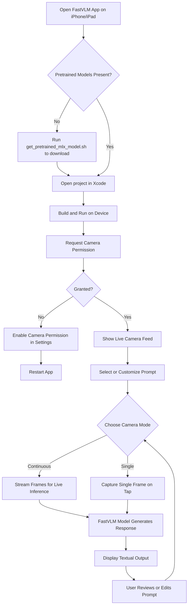

# Running FastVLM on iOS Devices

## Overview
This guide walks you through running the **FastVLM** demo application on Apple devices such as iPhone and iPad. It covers the key steps from installing or building the app, configuring the live camera feed, to performing real-time vision-language inference. Whether you’re an end-user eager to explore FastVLM’s powerful on-device inference or a developer integrating it into your app, this guide delivers clear, actionable instructions to get started quickly and effectively.

---

## 1. Preparing to Run the FastVLM App

### Prerequisites
- An iPhone or iPad running iOS 18.2 or later.
- Xcode installed on your Mac if building the app from source.
- Access to pretrained FastVLM models downloaded into the app's expected directory.
- Camera permissions enabled on your device.

### Expected Outcome
By completing this guide, you will have the FastVLM demo app running on your iOS device, streaming live camera video, and generating vision-language model responses in real time.

### Time Estimate
About 15–30 minutes, depending on model download time and device setup.

### Difficulty Level
Beginner to intermediate (no prior ML knowledge required; basic iOS usage or Xcode familiarity helpful).

---

## 2. Installing and Building the FastVLM Demo App

### Step 1: Download Pretrained Models

1. Access the script `app/get_pretrained_mlx_model.sh` supplied with the FastVLM repository.
2. Make the script executable:

```shell
chmod +x app/get_pretrained_mlx_model.sh
```

3. Choose a pretrained model size and download it. For example, to download the 0.5B model:

```shell
app/get_pretrained_mlx_model.sh --model 0.5b --dest app/FastVLM/model
```

> This step can take several minutes depending on your internet speed. Ensure the models are downloaded to the exact directory `app/FastVLM/model`.

### Step 2: Open and Build with Xcode

1. Open the FastVLM project in Xcode.
2. Select your connected iOS device or simulator as the build target.
3. Build and run the app.

If using the Simulator, camera access won’t be available, so live video functionality is limited.

---

## 3. Understanding the User Interface

The FastVLM app interface is designed to deliver a cohesive real-time experience:

- **Live Camera Feed**: Shows the current video frame from the device camera.
- **Prompt Section**: Displays and allows editing of the active prompt guiding the model’s descriptions.
- **Response Section**: Shows the model’s generated textual output in response to the camera image.
- **Status Indicator**: Displays processing status and Time-To-First-Token (TTFT) metrics.
- **Toolbar**: Includes buttons for accessing app info, switching cameras, and selecting or customizing prompts.

### Key UI Actions
- Tap the camera switch icon to toggle front/back cameras.
- Use the **Prompts** menu to select a predefined prompt like "Describe the image" or "Facial expression".
- Choose **Customize...** in Prompts to edit or create your own prompt messages.
- Tap captured photo button when in single frame mode to analyze a still frame.

---

## 4. Running Real-time Vision-Language Inference

### Continuous (Streaming) Mode

1. Select **Continuous** camera mode from the segmented control.
2. The app streams video frames continuously to the FastVLM model.
3. You see updated textual responses generated live with each frame.
4. The TTFT shows how quickly the model produces the first token after capture.

This mode is ideal for live scene understanding or dynamic visual question answering.

### Single Frame Mode

1. Switch the camera type to **Single**.
2. The video feed pauses automatically.
3. Tap the "Capture Photo" button to analyze the current frame.
4. The generated response displays in the output section.

Use this mode to analyze individual snapshots on demand.

---

## 5. Customizing Prompts

Prompts guide how FastVLM interprets images and generate outputs.

### Using Built-in Prompts

- Tap the **Prompts** button in the top-right toolbar.
- Select options like:
  - *Describe image* - Outputs a brief description.
  - *Facial expression* - Outputs one or two words about emotions.
  - *Read text* - Extracts text visible in the image.

These prompt selections immediately update the input prompt used by the model.

### Editing or Adding Prompts

- Choose the **Customize...** option in the Prompts menu.
- Edit the prompt and prompt suffix using the text editors displayed.
- Tap **Done** to save changes and return to the response view.

<Tip>
Modifying prompts can affect model output quality and safety because the underlying FastVLM model utilizes Qwen2-Instruct LLMs without additional safety tuning. Use caution when inputting custom prompts.
</Tip>

---

## 6. Managing Camera and Permissions

### Camera Access

- The app will request camera permissions on first use.
- Grant permission when prompted to enable live video.
- If permission is denied, the app cannot stream camera frames.

### Switching Cameras

- Use the camera switch button (showing a camera and cycle arrows) on the bottom right of the video feed (iOS only).
- Switch between front and back cameras seamlessly.

### Troubleshooting Camera Issues

<AccordionGroup title="Camera Troubleshooting"> 
<Accordion title="No Video Feed or Black Screen">
- Ensure camera permission is granted in Settings > Privacy > Camera.
- Confirm the device has a functional camera.
- Restart the app or device to refresh camera access.
</Accordion> 
<Accordion title="Camera Switch Button Not Responding">
- Toggle the camera mode between Single and Continuous.
- Rebuild the app if running from Xcode.
- Confirm the device supports multiple cameras.
</Accordion>
</AccordionGroup>

---

## 7. Understanding Status and Performance

### Status States
- **Idle**: The model is not processing data.
- **Processing Prompt**: Model is preparing inference based on input prompt and image.
- **Generating Response**: Model is producing output tokens.

### Time-To-First-Token (TTFT)
- TTFT shows latency from image capture to the first generated token.
- Displayed in milliseconds at the top overlay.
- Lower TTFT correlates to faster responsiveness.

### Performance Tips
- Using smaller models like FastVLM 0.5B reduces latency.
- Avoid very complex prompts that increase processing time.
- Use Continuous mode for dynamic live output; Single mode when you want controlled snapshots.

---

## 8. Quick Common Issues and Troubleshooting

<AccordionGroup title="Common App Issues"> 
<Accordion title="Model Output is Empty or Stuck">
- Verify the model files are correctly downloaded in `app/FastVLM/model`.
- Cancel any ongoing inference by tapping **Done** when editing a prompt.
- Restart the app to reset model loading.
</Accordion> 
<Accordion title="App Crashes on Launch">
- Check for insufficient device storage or permissions.
- Confirm you are running on supported iOS version (18.2+).
- Review device console logs from Xcode for errors.
</Accordion>
<Accordion title="Camera Not Detected or Permission Denied">
- In iOS Settings, enable camera permissions for the app.
- Reinstall the app and monitor permission prompts.
- Test the device camera using the native Camera app to isolate hardware issues.
</Accordion>
</AccordionGroup>

---

## 9. Best Practices and Tips

- **Prompt Design**: Keep prompts concise and instructive for best results.
- **Privacy**: All inference runs fully on device; no camera images are uploaded.
- **Battery Use**: Continuous camera and model use consumes battery quickly; monitor your device.
- **Switching Models**: To try different FastVLM sizes, download alternate models and rebuild the app.

---

## 10. Next Steps & Related Documentation

- Review the guide on [Running Inference with FastVLM](https://docs.example.com/guides/core-workflows/inference-basics) for command-line and Python usage.
- Explore [Exporting Models for Apple Silicon](https://docs.example.com/guides/platform-integration/apple-silicon-inference) to optimize models for Apple devices.
- See [Fine-tuning & Training Custom FastVLM Models](https://docs.example.com/guides/core-workflows/finetuning-models) to tailor models for your use cases.
- Consult the [FastVLM Overview](https://docs.example.com/overview/intro-value/fastvlm-overview) for product background and architecture.

---

## Appendix: Code Snippet Illustrating Camera Control Integration

Here is an excerpt demonstrating the camera switch button and its binding to device camera selection in the iOS FastVLM app:

```swift
Button {
    backCamera.toggle()
} label: {
    RoundedRectangle(cornerRadius: 8.0)
        .fill(.regularMaterial)
        .frame(width: 32.0, height: 32.0)
        .overlay(alignment: .center) {
            Image(systemName: "arrow.triangle.2.circlepath.camera.fill")
                .foregroundStyle(.primary)
                .padding(6.0)
        }
}
```

This control toggles between the front and back cameras, updating the video feed used by the app.

---

## Visual User Flow Diagram



This flow captures the typical user journey for running FastVLM on iOS devices.

---

## Final Notes
FastVLM’s iOS integration showcases efficient on-device, real-time vision-language inference powered by FastViTHD and Qwen2 LLMs. This guide equips you with all you need to run the app, explore prompts, and understand system behavior, unlocking the fast and private AI experience Apple Silicon enables.

For a complete developer experience, refer to the app source code and the related guides linked above.


