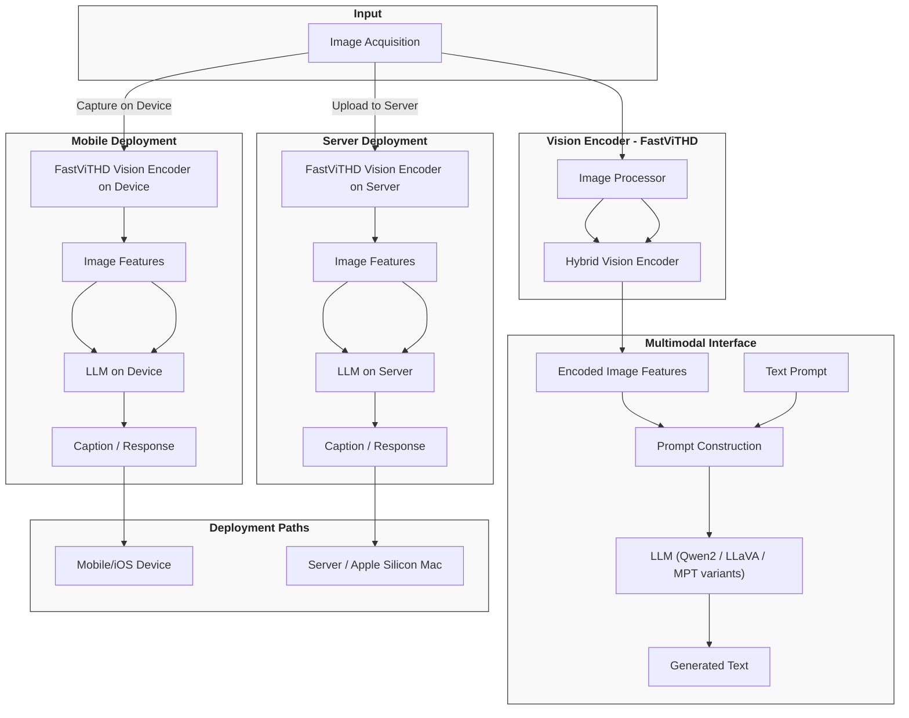

# System Architecture & Data Flow

FastVLM integrates state-of-the-art components in vision-language modeling to deliver a seamless, efficient pipeline that transforms raw images into rich, natural language descriptions. This page walks you through the visual architecture diagram built with Mermaid.js, showcasing how the vision encoder, language model, and multimodal interface collaborate to process inputs and generate outputs. You will follow the journey from image acquisition through encoding to language generation, highlighting both mobile and server deployment pathways.

---

## Visual Architecture Overview

At its core, FastVLM achieves a balance of speed and accuracy by combining a high-resolution vision encoder with powerful language models via a multimodal interface. The diagram below illustrates the major subsystems, their interactions, and the paths images take through the system:

---

## Journey from Image to Text: Step-by-Step

1. **Image Acquisition**
   - Capture or provide an image either from a mobile device camera or upload it to the server.
   - This raw image is the starting point

2. **Vision Encoding**
   - The image is preprocessed using a dedicated image processor to normalize and resize inputs based on model configuration.
   - FastVLM’s FastViTHD hybrid vision encoder then rapidly extracts rich visual representations.
   - This encoding step transform images into dense tokens/fixed-size features that the language model can consume.

3. **Multimodal Prompt Construction**
   - Simultaneously, the user’s text prompt (e.g., 'Describe the image.') is combined with the encoded image features.
   - The multimodal interface injects special image tokens into the textual prompt ensuring proper alignment and context for the language model.

4. **Natural Language Generation**
   - The constructed prompt is passed into the large language model (Qwen2, LLaVA, or MPT variants) for contextual understanding.
   - The language model generates coherent natural language output describing or answering questions about the image, leveraging both modalities.

5. **Output Delivery**
   - The generated text is presented back to the user via the same platform (mobile device display or server API response).

---

## Deployment Variants: Mobile vs Server

### Mobile Path

- Enables processing directly on iOS devices or Apple Silicon Macs.
- Vision encoding and language model inference both occur on-device preserving privacy and minimizing latency.
- Suitable for real-time applications where network connectivity is limited or user data sensitivity is paramount.

### Server Path

- Images are uploaded to cloud servers equipped with GPUs or Apple Silicon hardware.
- Computation-intensive encoding and language generation occur server-side.
- Ideal for applications requiring heavier models or centralized processing with aggregated data.

---

## Practical Tips & Best Practices

- **Prompt Construction:** Use the special image tokens (`<im_start><image><im_end>`) effectively to ensure correct multimodal interpretation.
- **Image Resolution:** Adjust input image size according to deployment constraints — lower resolutions for mobile can greatly speed up encoding.
- **Model Selection:** Choose appropriate LLM variants (Qwen2, LLaVA, MPT) based on your inference latency and accuracy needs.
- **Resource Allocation:** For server deployment, leverage batch processing and optimized device placement to maximize throughput.

---

## Troubleshooting Common Issues

<AccordionGroup title="Troubleshooting Insights">
<Accordion title="Image Not Processing Correctly">
Ensure images are converted to RGB color space before encoding and that image paths/URLs are accessible. Use the provided `load_image` utility to handle this.
</Accordion>
<Accordion title="Prompt Misalignment or Unexpected Outputs">
Verify that the constructed prompt includes the special image tokens correctly and corresponds to the expected conversation mode for the model.
</Accordion>
<Accordion title="Slow Inference on Mobile">
Optimize for inference speed by selecting FastViTHD variants with smaller image resolution and quantized models, following model export guidelines for Apple Silicon.
</Accordion>
</AccordionGroup>

---

## Additional Resources

- For details on model loading and prompt handling mechanics, see the [predict.py](../predict.py) and [cli.py](../llava/serve/cli.py) pages.
- The vision encoder options and configurations are documented under [multimodal_encoder](../llava/model/multimodal_encoder/builder.py).
- For deployment on Apple Silicon and iOS devices, refer to the [model export instructions](../model_export/README.md).
- To understand the language model integration, consult [llava_llama.py](../llava/model/language_model/llava_llama.py) and [llava_mpt.py](../llava/model/language_model/llava_mpt.py).

---

This architectural diagram and structured workflow explain the interactions inside FastVLM that empower you to build fast, accurate vision-language applications both in mobile and server scenarios. Understanding this flow will help you optimize deployments, debug issues, and extend functionality effectively.

---